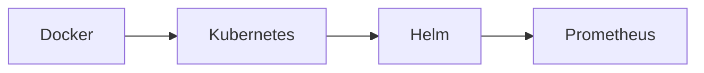

# Omar Hussein | DevOps Engineer ☁️

🔧 Infrastructure Craftsman | Cloud Apprentice | Automation Explorer  
📚 Currently Mastering: Terraform, Kubernetes, and Cloud-Native Patterns  
🚀 Goal: To build resilient systems and contribute to meaningful DevOps projects  

---

### 🛠 Core Competencies

#### ☁️ Cloud Platforms


#### 🏗 Infrastructure as Code
+ Terraform       [■■■■■□□□] 70%
+ Ansible        [■■■■□□□□] 50%
+ Crossplane     [■□□□□□□□] 10%
+ Pulumi         [■■□□□□□□] 20%

#### 🚦 CI/CD Pipelines


#### 🐳 Container Ecosystem


#### 🔍 Observability Stack


#### 🛡 DevSecOps Tools
```bash
# Security Scanning
$ trivy image my-app:latest
$ kubectl apply -f kube-bench.yaml
```

---

### 📊 Skill Matrix

| Category       | Tools                          |
|----------------|--------------------------------|
| Version Control | Git, GitHub, GitLab         |
| Scripting       | Bash, Python, Go            |
| OS              | Linux (Ubuntu/CentOS), Windows Server |
| Databases       | PostgreSQL, MongoDB, Redis  |

---

### 🌱 Current Projects
1. **Automated Cloud Lab** - Terraform+Ansible playground ([GitHub](https://github.com/your-repo))  
2. **K8s Home Cluster** - Raspberry Pi Kubernetes cluster with monitoring  
3. **CI/CD Pipeline** - From code commit to production deployment  

---

### 📫 Let's Connect
[](https://linkedin.com/in/yourprofile)
[](mailto:your.email@example.com)


```
